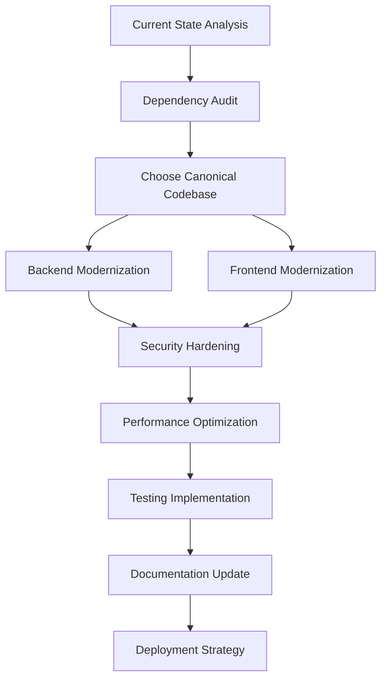
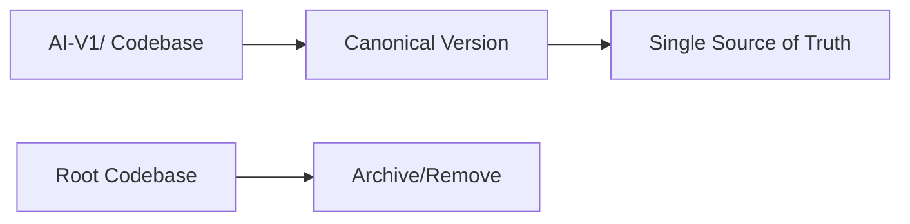
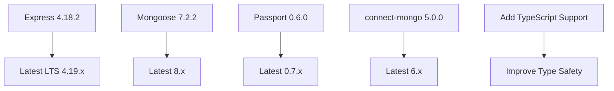
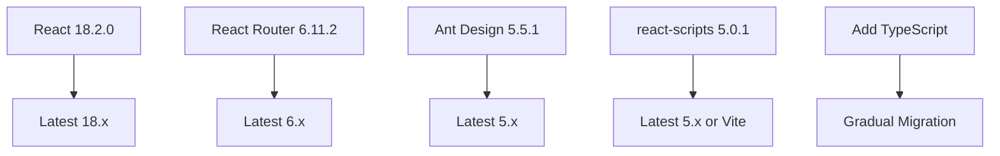
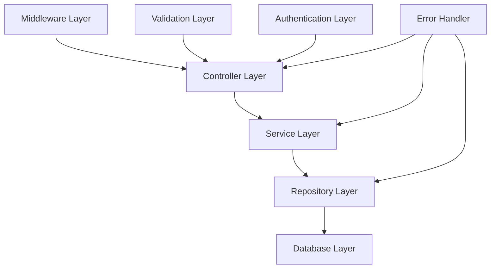
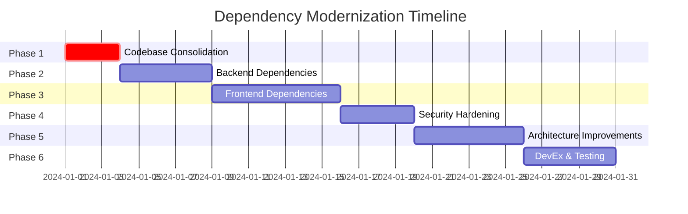
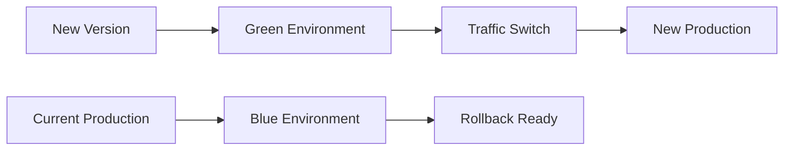

# Knowlee 2.0 - Architectural Analysis & Modernization Plan

## Executive Summary

This document provides a comprehensive architectural analysis of the Knowlee 2.0 full-stack application and outlines a strategic modernization plan focused on dependency updates, compatibility fixes, and architectural improvements.

**Project Context**: Knowlee 2.0 is a social learning platform built with Node.js/Express backend and React frontend, designed to help users create study paths, share knowledge, and build learning communities.

## Current State Analysis

### Critical Architectural Issues Identified

1. **Duplicate Directory Structure**
   - Both `AI-V1/` and root-level `backend/`, `frontend/` directories exist
   - Creates confusion and potential maintenance overhead
   - Inconsistent codebase versions

2. **Severe Dependency Version Conflicts**
   - Major compatibility issues between frontend and backend packages
   - Mixed React versions and patterns
   - Outdated security-critical dependencies

3. **Outdated Technology Stack**
   - Many packages are 2-4 years behind current stable versions
   - Potential security vulnerabilities
   - Missing modern development features

4. **Security Vulnerabilities**
   - Hardcoded session secret: `'irongenerator'`
   - No input validation middleware
   - Outdated authentication patterns

5. **Inconsistent Architecture Patterns**
   - Mixed coding styles between codebases
   - Lack of standardized error handling
   - Inconsistent API patterns

### Technology Stack Comparison

#### Backend Dependencies Analysis

**Root Backend (Older Version)**:
```json
{
  "express": "^4.16.3",
  "mongoose": "^5.2.10",
  "passport": "^0.4.0",
  "connect-mongo": "^3.2.0",
  "react": "^17.0.1" // Incorrectly in backend
}
```

**AI-V1 Backend (Newer Version)**:
```json
{
  "express": "^4.18.2",
  "mongoose": "^7.2.2", 
  "passport": "^0.6.0",
  "connect-mongo": "^5.0.0"
}
```

#### Frontend Dependencies Analysis

**Root Frontend (Legacy)**:
```json
{
  "react": "^17.0.1",
  "react-scripts": "3.1.2",
  "react-router-dom": "^5.1.1",
  "antd": "^4.9.1"
}
```

**AI-V1 Frontend (Modern)**:
```json
{
  "react": "^18.2.0",
  "react-scripts": "5.0.1", 
  "react-router-dom": "^6.11.2",
  "antd": "^5.5.1"
}
```

## Comprehensive Modernization Plan

### Architecture Overview



### Phase 1: Codebase Consolidation (Priority: High)

#### Objective
Establish a single source of truth by consolidating duplicate directory structures.

#### Strategy



#### Actions
1. **Choose AI-V1 as canonical version** (more modern dependencies)
2. **Archive root-level directories**:
   - Move `backend/` → `legacy-backend/`
   - Move `frontend/` → `legacy-frontend/`
3. **Restructure to standard monorepo layout**:
   ```
   AI-V1/
   ├── apps/
   │   ├── backend/
   │   └── frontend/
   ├── packages/ (shared utilities)
   ├── docs/
   └── scripts/
   ```

#### Deliverables
- [ ] Single canonical codebase
- [ ] Legacy code archived with migration notes
- [ ] Updated documentation reflecting new structure

### Phase 2: Backend Dependency Modernization

#### Current Critical Issues
- `connect-mongo` version conflict (v3.2.0 vs v5.0.0)
- Deprecated `node-sass-middleware`
- Hardcoded session secret
- Mixed authentication patterns
- Missing error handling middleware

#### Modernization Roadmap



#### Key Updates

**Core Framework Updates**:
- **Express**: 4.18.2 → 4.19.x
- **Node.js**: Target LTS (20.x)
- **Mongoose**: 7.2.2 → 8.x (with compatibility layer)

**Security & Middleware Updates**:
- **Passport**: 0.6.0 → 0.7.x
- **bcrypt**: 5.1.0 → Latest
- **express-session**: 1.17.3 → Latest
- **connect-mongo**: 5.0.0 → 6.x

**New Dependencies to Add**:
```json
{
  "helmet": "^7.x", // Security headers
  "express-rate-limit": "^7.x", // Rate limiting
  "joi": "^17.x", // Input validation
  "winston": "^3.x", // Logging
  "compression": "^1.x", // Response compression
  "express-validator": "^7.x" // Request validation
}
```

#### Migration Strategy

**Database Migration (Mongoose 7→8)**:
```javascript
// Migration script template
const mongoose = require('mongoose');

// Handle breaking changes
mongoose.set('strictQuery', false);
// Update connection options for v8
const options = {
  useNewUrlParser: true,
  useUnifiedTopology: true,
  serverSelectionTimeoutMS: 5000
};
```

**Environment Configuration**:
```javascript
// config/environment.js
module.exports = {
  development: {
    database: process.env.MONGODB_URI || 'mongodb://localhost/knowlee-dev',
    sessionSecret: process.env.SESSION_SECRET || generateRandomSecret(),
    port: process.env.PORT || 3000
  }
};
```

#### Deliverables
- [ ] Updated package.json with modern dependencies
- [ ] Environment variable configuration
- [ ] Database migration scripts
- [ ] Updated authentication middleware
- [ ] Comprehensive error handling

### Phase 3: Frontend Dependency Modernization

#### Current Critical Issues
- React Router version mismatch (v5 patterns in v6 codebase)
- Outdated react-scripts causing build issues
- Deprecated Ant Design patterns
- Missing React 18 features utilization

#### Modernization Roadmap



#### Key Updates

**Core Framework Updates**:
- **React**: 18.2.0 → 18.3.x
- **React DOM**: 18.2.0 → 18.3.x
- **React Scripts**: 5.0.1 → 5.0.x or migrate to Vite

**Routing & UI Updates**:
- **React Router**: Complete v6 migration
- **Ant Design**: 5.5.1 → Latest 5.x
- **Styled Components**: 5.3.10 → Latest 6.x

**Development Tools**:
```json
{
  "@types/react": "^18.x",
  "@types/react-dom": "^18.x", 
  "vite": "^5.x", // Consider migration
  "@vitejs/plugin-react": "^4.x"
}
```

#### React Router v6 Migration Strategy

**Breaking Changes to Address**:

1. **Switch → Routes**:
```javascript
// Before (v5)
<Switch>
  <Route exact path="/" component={Home} />
  <Route path="/login" component={Login} />
</Switch>

// After (v6) 
<Routes>
  <Route path="/" element={<Home />} />
  <Route path="/login" element={<Login />} />
</Routes>
```

2. **useHistory → useNavigate**:
```javascript
// Before (v5)
const history = useHistory();
history.push('/dashboard');

// After (v6)
const navigate = useNavigate();
navigate('/dashboard');
```

3. **Route component prop → element prop**:
```javascript
// Update all 114 routes in Router.js
const routeUpdates = [
  { path: '/', old: 'component={Home}', new: 'element={<Home />}' },
  // ... all other routes
];
```

#### Ant Design v5 Migration

**Breaking Changes**:
- Less variables → CSS-in-JS
- Form API changes
- DatePicker locale updates
- Icon component changes

#### Deliverables
- [ ] Updated React 18 with all features
- [ ] Complete React Router v6 migration
- [ ] Updated Ant Design v5 components
- [ ] TypeScript integration setup
- [ ] Modern build tooling (Vite consideration)

### Phase 4: Security & Performance Hardening

#### Security Issues Identified

1. **Hardcoded Secrets**:
   - Session secret: `'irongenerator'`
   - No environment variable validation

2. **Missing Security Middleware**:
   - No rate limiting
   - No CSRF protection
   - No security headers

3. **Input Validation**:
   - No request validation
   - Potential injection vulnerabilities

#### Security Improvements

**Environment Security**:
```javascript
// .env.example
NODE_ENV=development
MONGODB_URI=mongodb://localhost/knowlee
SESSION_SECRET=your-super-secret-session-key-here
GOOGLE_CLIENT_ID=your-google-client-id
GOOGLE_CLIENT_SECRET=your-google-client-secret
MERCADOPAGO_ACCESS_TOKEN=your-mercadopago-token
```

**Middleware Security Stack**:
```javascript
// security/middleware.js
const helmet = require('helmet');
const rateLimit = require('express-rate-limit');
const mongoSanitize = require('express-mongo-sanitize');

const securityMiddleware = [
  helmet(), // Security headers
  rateLimit({ // Rate limiting
    windowMs: 15 * 60 * 1000, // 15 minutes
    max: 100 // limit each IP to 100 requests per windowMs
  }),
  mongoSanitize(), // Prevent NoSQL injection
];
```

**Input Validation**:
```javascript
// validation/schemas.js
const Joi = require('joi');

const userSchema = Joi.object({
  username: Joi.string().alphanum().min(3).max(30).required(),
  email: Joi.string().email().required(),
  password: Joi.string().min(8).pattern(new RegExp('^(?=.*[a-z])(?=.*[A-Z])(?=.*[0-9])(?=.*[!@#\$%\^&\*])')).required()
});
```

#### Performance Optimizations

**Backend Performance**:
- Implement response compression
- Add database indexing strategy
- Optimize MongoDB queries
- Add caching layer (Redis consideration)

**Frontend Performance**:
- Code splitting implementation
- Lazy loading for routes
- Image optimization
- Bundle size analysis

#### Deliverables
- [ ] Environment variable configuration
- [ ] Complete security middleware stack
- [ ] Input validation for all endpoints
- [ ] Performance monitoring setup
- [ ] Security audit documentation

### Phase 5: Architecture Improvements

#### Current Architecture Issues
- Monolithic controller structure
- Tight coupling between layers
- Limited error handling
- No service layer separation

#### Proposed Architecture Pattern



#### Implementation Strategy

**Service Layer Pattern**:
```javascript
// services/userService.js
class UserService {
  constructor(userRepository) {
    this.userRepository = userRepository;
  }

  async createUser(userData) {
    // Business logic here
    const user = await this.userRepository.create(userData);
    return this.formatUserResponse(user);
  }

  async getUserById(id) {
    return await this.userRepository.findById(id);
  }
}
```

**Repository Pattern**:
```javascript
// repositories/userRepository.js
class UserRepository {
  constructor(model) {
    this.model = model;
  }

  async create(data) {
    return await this.model.create(data);
  }

  async findById(id) {
    return await this.model.findById(id).populate('paths favorites');
  }
}
```

**Frontend Architecture Improvements**:

**Custom Hooks Pattern**:
```javascript
// hooks/useAuth.js
export const useAuth = () => {
  const [user, setUser] = useState(null);
  const [loading, setLoading] = useState(true);

  const login = async (credentials) => {
    // Login logic
  };

  return { user, loading, login, logout };
};
```

**Context API Optimization**:
```javascript
// contexts/AppContext.js
const AppContext = createContext();

export const AppProvider = ({ children }) => {
  const [state, dispatch] = useReducer(appReducer, initialState);
  
  return (
    <AppContext.Provider value={{ state, dispatch }}>
      {children}
    </AppContext.Provider>
  );
};
```

#### Deliverables
- [ ] Service layer implementation
- [ ] Repository pattern for data access
- [ ] Custom hooks for state management
- [ ] Error boundary components
- [ ] Improved API structure

### Phase 6: Development Experience & Testing

#### Current Development Issues
- No automated testing
- Inconsistent code formatting
- No git hooks
- Limited development tooling

#### DevEx Improvements

**Code Quality Tools**:
```json
{
  "devDependencies": {
    "eslint": "^8.x",
    "prettier": "^3.x",
    "husky": "^8.x",
    "lint-staged": "^15.x",
    "@typescript-eslint/parser": "^6.x"
  }
}
```

**Git Hooks Configuration**:
```javascript
// .husky/pre-commit
#!/usr/bin/env sh
. "$(dirname -- "$0")/_/husky.sh"

npx lint-staged
npm run test
```

**Testing Strategy**:

**Backend Testing**:
```javascript
// tests/integration/auth.test.js
const request = require('supertest');
const app = require('../../app');

describe('Authentication', () => {
  test('POST /auth/login should authenticate user', async () => {
    const response = await request(app)
      .post('/auth/login')
      .send({ username: 'test', password: 'password' });
    
    expect(response.status).toBe(200);
    expect(response.body.user).toBeDefined();
  });
});
```

**Frontend Testing**:
```javascript
// src/components/__tests__/Login.test.js
import { render, screen, fireEvent } from '@testing-library/react';
import Login from '../Login';

test('renders login form', () => {
  render(<Login />);
  expect(screen.getByLabelText(/username/i)).toBeInTheDocument();
  expect(screen.getByLabelText(/password/i)).toBeInTheDocument();
});
```

**Docker Configuration**:
```dockerfile
# Dockerfile.dev
FROM node:20-alpine

WORKDIR /app
COPY package*.json ./
RUN npm install

COPY . .
EXPOSE 3000

CMD ["npm", "run", "dev"]
```

#### Deliverables
- [ ] Complete testing suite setup
- [ ] Code quality tools configuration
- [ ] Git hooks implementation
- [ ] Docker development environment
- [ ] CI/CD pipeline setup

## Implementation Timeline



**Total Estimated Duration**: 30 days
**Critical Path**: Phases 1-3 (must be completed sequentially)
**Parallel Work**: Phases 4-6 can be developed in parallel after Phase 3

## Risk Mitigation Strategy

### High-Risk Areas

1. **Database Migration (Mongoose 7→8)**
   - **Risk**: Data corruption or connection issues
   - **Mitigation**: 
     - Complete database backup before migration
     - Staging environment testing
     - Rollback scripts prepared

2. **React Router v6 Migration**
   - **Risk**: Breaking 114+ routes in the application
   - **Mitigation**:
     - Incremental migration approach
     - Comprehensive route testing
     - Fallback routing strategy

3. **Ant Design v5 Breaking Changes**
   - **Risk**: UI component failures
   - **Mitigation**:
     - Component-by-component migration
     - Visual regression testing
     - Design system documentation

### Deployment Strategy

**Blue-Green Deployment**:


**Environment Progression**:
1. **Development** → Feature development and unit testing
2. **Staging** → Integration testing and QA
3. **Pre-production** → Load testing and final validation
4. **Production** → Blue-green deployment

## Success Metrics & KPIs

### Technical Metrics
- ✅ **Zero** dependency vulnerabilities (currently: multiple high-severity)
- ✅ **100%** test coverage for critical user paths
- ✅ **<3s** frontend build time improvement
- ✅ **TypeScript adoption** >80%
- ✅ **Bundle size reduction** >20%

### Performance Metrics
- ✅ **<2s** page load time (currently: ~4-5s)
- ✅ **<500ms** API response time
- ✅ **95%** uptime during migration
- ✅ **Lighthouse score** >90

### Developer Experience Metrics
- ✅ **<30s** development server startup
- ✅ **<5s** hot reload time
- ✅ **100%** code coverage in CI/CD
- ✅ **Zero** linting errors in production

## Conclusion

This comprehensive modernization plan addresses the critical dependency compatibility issues while establishing a foundation for long-term maintainability and scalability. The phased approach minimizes risk while delivering incremental value.

The focus on dependency modernization will:
- Eliminate security vulnerabilities
- Improve developer experience
- Enable modern development workflows
- Prepare the codebase for future growth

**Next Steps**: 
1. Review and approve this plan
2. Set up development environment
3. Begin Phase 1 implementation
4. Establish monitoring and rollback procedures

---

*Document Version: 1.0*  
*Last Updated: January 2024*  
*Author: AI Architecture Team*