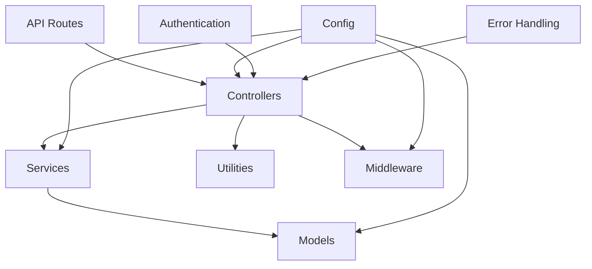

# Backend Improvement Plan

## 1. Create utility functions and shared middleware
- Implement a centralized error handling middleware
- Create a response formatting utility
- Develop database query utility functions
- Implement input validation middleware

## 2. Refactor controllers
- Consolidate similar functions (e.g., product detail functions)
- Standardize error messages and HTTP status codes
- Utilize new utility functions and middleware

## 3. Improve route organization
- Group related routes
- Implement versioning for API routes

## 4. Enhance model structure
- Review and optimize schema definitions
- Implement pre-save hooks for common operations

## 5. Create a centralized configuration file
- Move common settings to a single file
- Implement environment-specific configurations

## 6. Implement proper authentication and authorization
- Review and enhance existing authentication methods
- Implement role-based access control

## 7. Optimize database queries
- Review and optimize `populate()` usage
- Implement indexing for frequently queried fields

## 8. Improve code organization
- Establish a consistent file naming convention
- Organize files into appropriate subdirectories

## Implementation Diagram

This plan addresses the identified issues in the backend structure and provides a roadmap for improving code organization, reducing duplication, and enhancing maintainability.